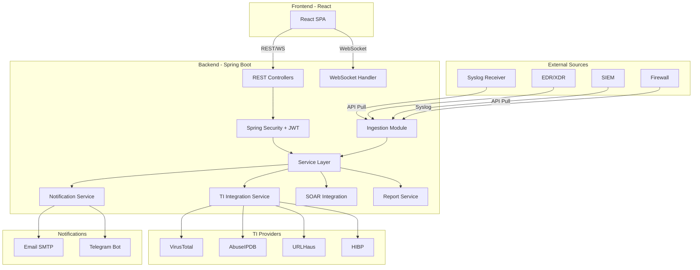
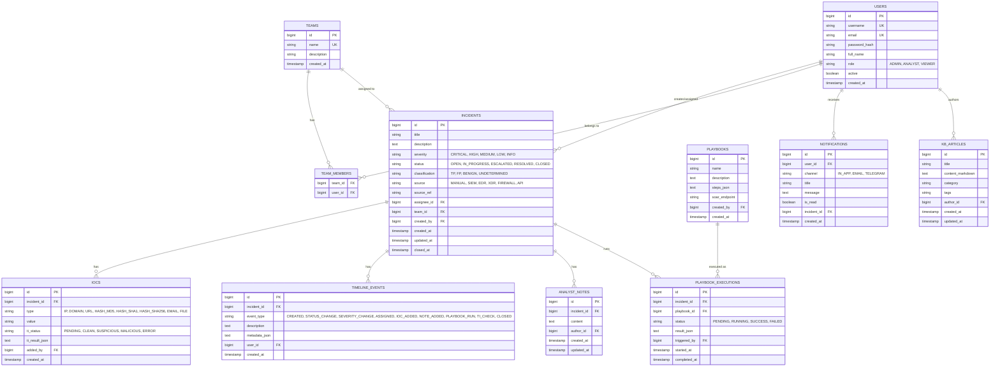

# Unified Incident Management & Response Platform (UIMR)

Mərkəzləşdirilmiş insidentlərin idarəedilməsi və cavablandırılması platforması — SOC komandaları üçün insidentlərin yaradılması, izlənməsi, IOC analizi, SOAR inteqrasiyası və bildiriş mexanizmləri ilə tam funksional bir platforma.

## Tech Stack

| Layer | Technology |
|-------|-----------|
| Backend | Java 17, Spring Boot 3.x, Spring Security, Spring Data JPA |
| Frontend | React 18 + Vite, React Router, Zustand (state), Axios |
| Database | PostgreSQL 15 (H2 for dev/test) |
| Real-time | WebSocket (STOMP over SockJS) |
| Auth | JWT (Access + Refresh tokens) |
| Build | Maven (backend), npm (frontend) |

---

## Architecture Overview



---

## Database Schema



---

## Proposed Changes

### Backend — Spring Boot Project

#### [NEW] `backend/` — Maven Project Structure

```
backend/
├── pom.xml
├── src/main/java/com/uimr/
│   ├── UimrApplication.java
│   ├── config/
│   │   ├── SecurityConfig.java          — JWT filter chain, CORS
│   │   ├── WebSocketConfig.java         — STOMP/SockJS setup
│   │   └── RestTemplateConfig.java      — For TI API calls
│   ├── model/
│   │   ├── User.java
│   │   ├── Team.java
│   │   ├── Incident.java
│   │   ├── Ioc.java
│   │   ├── TimelineEvent.java
│   │   ├── AnalystNote.java
│   │   ├── Playbook.java
│   │   ├── PlaybookExecution.java
│   │   ├── Notification.java
│   │   └── KbArticle.java
│   ├── model/enums/
│   │   ├── Severity.java
│   │   ├── IncidentStatus.java
│   │   ├── Classification.java
│   │   ├── IncidentSource.java
│   │   ├── IocType.java
│   │   ├── TiStatus.java
│   │   ├── TimelineEventType.java
│   │   ├── PlaybookStatus.java
│   │   ├── NotificationChannel.java
│   │   └── UserRole.java
│   ├── repository/
│   │   ├── UserRepository.java
│   │   ├── TeamRepository.java
│   │   ├── IncidentRepository.java
│   │   ├── IocRepository.java
│   │   ├── TimelineEventRepository.java
│   │   ├── AnalystNoteRepository.java
│   │   ├── PlaybookRepository.java
│   │   ├── PlaybookExecutionRepository.java
│   │   ├── NotificationRepository.java
│   │   └── KbArticleRepository.java
│   ├── dto/
│   │   ├── request/    — CreateIncidentRequest, UpdateIncidentRequest, etc.
│   │   └── response/   — IncidentResponse, DashboardStatsResponse, etc.
│   ├── service/
│   │   ├── AuthService.java
│   │   ├── UserService.java
│   │   ├── IncidentService.java
│   │   ├── IocService.java
│   │   ├── TimelineService.java
│   │   ├── NoteService.java
│   │   ├── ThreatIntelService.java       — VT, AbuseIPDB, URLHaus, HIBP
│   │   ├── NotificationService.java      — In-app, Email, Telegram
│   │   ├── PlaybookService.java
│   │   ├── DashboardService.java
│   │   ├── ReportService.java
│   │   ├── KnowledgeBaseService.java
│   │   └── IngestionService.java         — Syslog, API pull handlers
│   ├── controller/
│   │   ├── AuthController.java
│   │   ├── UserController.java
│   │   ├── IncidentController.java
│   │   ├── IocController.java
│   │   ├── TimelineController.java
│   │   ├── NoteController.java
│   │   ├── ThreatIntelController.java
│   │   ├── PlaybookController.java
│   │   ├── DashboardController.java
│   │   ├── ReportController.java
│   │   ├── KnowledgeBaseController.java
│   │   ├── NotificationController.java
│   │   └── IngestionController.java      — Webhook/Syslog receive endpoint
│   ├── security/
│   │   ├── JwtTokenProvider.java
│   │   ├── JwtAuthFilter.java
│   │   └── UserDetailsServiceImpl.java
│   └── exception/
│       ├── GlobalExceptionHandler.java
│       └── ResourceNotFoundException.java
├── src/main/resources/
│   ├── application.yml
│   └── application-dev.yml
└── src/test/java/com/uimr/
    └── ... (unit + integration tests)
```

**Key API Endpoints:**

| Method | Endpoint | Description |
|--------|----------|-------------|
| POST | `/api/auth/login` | Login, returns JWT |
| POST | `/api/auth/register` | Register user |
| GET | `/api/incidents` | List incidents (filterable, paginated) |
| POST | `/api/incidents` | Create incident |
| GET | `/api/incidents/{id}` | Get incident detail |
| PUT | `/api/incidents/{id}` | Update incident |
| PATCH | `/api/incidents/{id}/close` | Close incident (FP/TP/Benign) |
| PATCH | `/api/incidents/{id}/assign` | Assign to analyst/team |
| GET | `/api/incidents/{id}/iocs` | List IOCs for incident |
| POST | `/api/incidents/{id}/iocs` | Add IOC |
| POST | `/api/iocs/{id}/check-ti` | Run TI check on IOC |
| POST | `/api/iocs/bulk-check-ti` | Bulk TI check |
| GET | `/api/incidents/{id}/timeline` | Get timeline |
| GET | `/api/incidents/{id}/notes` | List notes |
| POST | `/api/incidents/{id}/notes` | Add note |
| GET | `/api/playbooks` | List playbooks |
| POST | `/api/playbooks` | Create playbook |
| POST | `/api/playbooks/{id}/execute` | Execute playbook on incident |
| GET | `/api/dashboard/stats` | Dashboard statistics |
| GET | `/api/reports/generate` | Generate report (PDF) |
| GET | `/api/notifications` | Get user notifications |
| PATCH | `/api/notifications/{id}/read` | Mark as read |
| GET | `/api/kb/articles` | List KB articles |
| POST | `/api/kb/articles` | Create KB article |
| POST | `/api/ingest/syslog` | Receive syslog events |
| POST | `/api/ingest/webhook` | Receive webhook events |

---

### Frontend — React Project

#### [NEW] `frontend/` — Vite + React Structure

```
frontend/
├── package.json
├── vite.config.js
├── index.html
├── public/
├── src/
│   ├── main.jsx
│   ├── App.jsx
│   ├── index.css                — Global design system
│   ├── api/
│   │   ├── axios.js             — Axios instance with JWT interceptor
│   │   ├── auth.js
│   │   ├── incidents.js
│   │   ├── iocs.js
│   │   ├── playbooks.js
│   │   ├── notifications.js
│   │   ├── dashboard.js
│   │   ├── reports.js
│   │   └── knowledgeBase.js
│   ├── store/
│   │   ├── authStore.js         — Zustand auth state
│   │   ├── incidentStore.js
│   │   └── notificationStore.js
│   ├── components/
│   │   ├── layout/
│   │   │   ├── Sidebar.jsx
│   │   │   ├── Header.jsx
│   │   │   ├── Layout.jsx
│   │   │   └── NotificationBell.jsx
│   │   ├── common/
│   │   │   ├── Button.jsx
│   │   │   ├── Modal.jsx
│   │   │   ├── DataTable.jsx
│   │   │   ├── Badge.jsx
│   │   │   ├── SearchBar.jsx
│   │   │   ├── Pagination.jsx
│   │   │   └── Toast.jsx
│   │   ├── incidents/
│   │   │   ├── IncidentCard.jsx
│   │   │   ├── IncidentForm.jsx
│   │   │   ├── IncidentTimeline.jsx
│   │   │   ├── IncidentCloseModal.jsx
│   │   │   └── SeverityBadge.jsx
│   │   ├── iocs/
│   │   │   ├── IocList.jsx
│   │   │   ├── IocForm.jsx
│   │   │   └── TiResultCard.jsx
│   │   ├── notes/
│   │   │   ├── NoteList.jsx
│   │   │   └── NoteForm.jsx
│   │   ├── playbooks/
│   │   │   ├── PlaybookList.jsx
│   │   │   └── PlaybookExecuteModal.jsx
│   │   ├── dashboard/
│   │   │   ├── StatsCards.jsx
│   │   │   ├── SeverityChart.jsx
│   │   │   ├── StatusChart.jsx
│   │   │   └── RecentIncidents.jsx
│   │   └── kb/
│   │       ├── ArticleList.jsx
│   │       ├── ArticleView.jsx
│   │       └── ArticleEditor.jsx
│   ├── pages/
│   │   ├── LoginPage.jsx
│   │   ├── DashboardPage.jsx
│   │   ├── IncidentListPage.jsx
│   │   ├── IncidentDetailPage.jsx
│   │   ├── CreateIncidentPage.jsx
│   │   ├── PlaybooksPage.jsx
│   │   ├── KnowledgeBasePage.jsx
│   │   ├── ReportsPage.jsx
│   │   ├── NotificationsPage.jsx
│   │   └── SettingsPage.jsx
│   └── utils/
│       ├── constants.js
│       ├── formatters.js
│       └── websocket.js
```

**Key Pages & Features:**

| Page | Features |
|------|----------|
| **Login** | JWT auth, remember me |
| **Dashboard** | Stats cards, severity/status charts, recent incidents, MTTR |
| **Incident List** | Filterable table (status, severity, source, assignee), search, pagination |
| **Incident Detail** | Full info, IOC panel, timeline, notes, playbook execution, close/assign |
| **Create/Edit Incident** | Multi-step form, severity, source selection, IOC addition |
| **Playbooks** | List, create, execute with incident context |
| **Knowledge Base** | Markdown articles, categories, search |
| **Reports** | Date range, filters, PDF export |
| **Notifications** | Real-time bell icon, notification list, mark as read |

---

## Implementation Phases

### Phase 1 — Backend Foundation (Days 1-2)
1. Initialize Spring Boot project with Maven
2. Configure PostgreSQL + JPA + Flyway migrations
3. Implement all JPA entities and enums
4. Implement repositories
5. Implement JWT authentication (register/login)
6. CORS configuration

### Phase 2 — Core Backend APIs (Days 3-5)
1. Incident CRUD with pagination/filtering
2. IOC CRUD + association with incidents
3. Timeline auto-recording (via service layer events)
4. Analyst Notes CRUD
5. Incident assignment logic
6. Incident close with classification (FP/TP/Benign)

### Phase 3 — Integration Services (Days 6-7)
1. TI service (VirusTotal, AbuseIPDB, URLHaus, HIBP HTTP clients)
2. Notification service (Email via JavaMail, Telegram via Bot API, In-app via WebSocket)
3. SOAR/Playbook execution service
4. Ingestion service (webhook endpoint for external sources)

### Phase 4 — Frontend Foundation (Days 8-9)
1. Vite + React project setup
2. Design system (CSS variables, dark theme, typography)
3. Layout (sidebar, header, routing)
4. Auth flow (login, JWT storage, axios interceptors)
5. Zustand stores

### Phase 5 — Frontend Pages (Days 10-13)
1. Dashboard with charts (Chart.js)
2. Incident list with DataTable
3. Incident detail with tabbed sections
4. IOC management inside incident
5. Timeline visualization
6. Notes section
7. Playbook UI
8. Knowledge Base pages
9. Notification bell + WebSocket integration
10. Report generation UI

### Phase 6 — Polish (Day 14)
1. Error handling & loading states
2. Responsive design
3. Micro-animations
4. Final integration testing

---

## User Review Required

> [!IMPORTANT]
> **Frontend Framework**: Plan proposes **React** (with Vite) over Angular — React has a larger ecosystem for SOC-style dashboards and faster iteration. If you prefer Angular, please specify.

> [!IMPORTANT]
> **Database**: Plan uses **PostgreSQL**. If you want H2 (embedded, no install needed) for development, let me know.

> [!IMPORTANT]
> **TI API Keys**: VirusTotal, AbuseIPDB, etc. require API keys. The system will work without them (graceful fallback) but actual lookups need keys configured in `application.yml`.

---

## Verification Plan

### Automated Tests
1. **Backend unit tests** — Run via `cd backend && mvn test`:
   - Service layer tests with mocked repositories
   - Controller tests with MockMvc
   - JWT token generation/validation tests

2. **Backend integration tests** — Run via `cd backend && mvn verify`:
   - Full API flow tests with H2 in-memory DB
   - Incident CRUD lifecycle test
   - Auth flow test

### Manual Verification
1. **Start backend**: `cd backend && mvn spring-boot:run`
2. **Start frontend**: `cd frontend && npm run dev`
3. **Browser testing** (using browser subagent):
   - Register a user and login
   - Create an incident with IOCs
   - Verify timeline records automatically
   - Add analyst notes
   - Close incident as TP/FP
   - View dashboard statistics
   - Check notification bell updates
4. **API testing** via curl/Postman:
   - Test all REST endpoints
   - Test WebSocket connection
   - Test ingestion webhook
